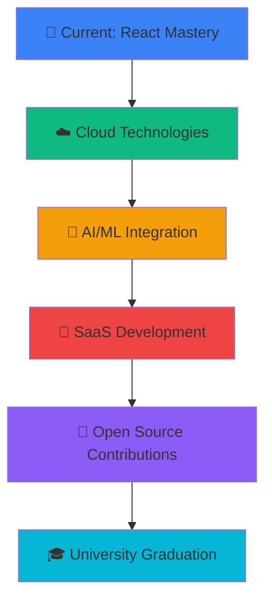

<div align="center">
  
</div>

<div align="center">
  <picture>
    <source media="(prefers-color-scheme: dark)" srcset="https://raw.githubusercontent.com/platane/platane/output/github-contribution-grid-snake-dark.svg">
    <source media="(prefers-color-scheme: light)" srcset="https://raw.githubusercontent.com/platane/platane/output/github-contribution-grid-snake.svg">
    
  </picture>
</div>

<div align="center">
  
</div>

<div align="center">
  
</div>

##  About Me

<div align="center">
  
</div>

<table>
<tr>
<td valign="top" width="50%">

### 🌟 Hello World! I'm Moch Yunus

```javascript
const developer = {
  name: "Moch Yunus",
  location: "East Java, Indonesia 🇮🇩",
  education: "University Student (Class of 2022)",
  passion: "Creating digital experiences that matter",
  currentMission: "Building the future, one line at a time",
  
  dailyRoutine: [
    "☕ Coffee++",
    "💻 Code",
    "🔄 Debug", 
    "🚀 Deploy",
    "🎯 Repeat"
  ],
  
  lifePhilosophy: "Turn coffee into code, bugs into features! ✨"
};
```

</td>
<td valign="top" width="50%">

### 🎯 Quick Facts


- 🎓 **Student Developer** from beautiful East Java
- 💻 **Full Stack enthusiast** with a love for clean code
- 🌱 Currently diving deep into **React ecosystem**
- 🔭 Exploring **cloud technologies** and **DevOps**
- 🎨 UI/UX enthusiast who believes in **pixel-perfect** designs
- 🎮 Gamer by night, coder by day
- 📚 Continuous learner and **open-source** contributor

<div align="center">
  
</div>

</td>
</tr>
</table>

##  Tech Stack & Skills

<div align="center">
  
</div>

<div align="center">

### 🎨 Frontend Universe
[](https://skillicons.dev)

### ⚙️ Backend Cosmos  
[](https://skillicons.dev)

### 🗄️ Database Galaxy
[](https://skillicons.dev)

### ☁️ DevOps & Tools
[](https://skillicons.dev)

</div>

<div align="center">
  
</div>

### 📊 GitHub Analytics

<div align="center">
  
  
</div>

<div align="center">
  
</div>

##  Current Mission & Projects

<div align="center">
  
</div>

<table>
<tr>
<td width="50%">

### 🔥 What I'm Coding Right Now


- 🚀 **Full-Stack Web Apps** - MERN/PERN stack mastery
- 🎨 **UI/UX Projects** - Crafting beautiful interfaces  
- ☁️ **Cloud Migration** - Learning AWS & DevOps patterns
- 🤖 **API Development** - RESTful & GraphQL services
- 📱 **Responsive Design** - Mobile-first approaches
- 🔐 **Authentication Systems** - Secure user management

</td>
<td width="50%">

### 🎯 2025 Goals & Achievements

- [x] ✅ Master React fundamentals
- [x] ✅ Learn TypeScript integration  
- [x] ✅ Build responsive web apps
- [ ] 🎯 Complete 5 full-stack projects
- [ ] 🌟 Contribute to open source (target: 10 PRs)
- [ ] 🚀 Launch personal SaaS product
- [ ] ☁️ Get AWS Developer certification
- [ ] 🎓 Graduate with honors
- [ ] 💼 Land awesome internship

<div align="center">
  
</div>

</td>
</tr>
</table>

### 🗺️ Learning Roadmap


```mermaid
graph TD
    A[🎯 Current: React Mastery] --> B[☁️ Cloud Technologies]
    B --> C[🤖 AI/ML Integration]
    C --> D[🚀 SaaS Development]
    D --> E[🌟 Open Source Contributions]
    E --> F[🎓 University Graduation]
    
    style A fill:#3B82F6
    style B fill:#10B981
    style C fill:#F59E0B
    style D fill:#EF4444
    style E fill:#8B5CF6
    style F fill:#06B6D4
```

##  Let's Connect & Build Amazing Things!

<div align="center">
  
</div>

<div align="center">
  
### 🤝 Ready to collaborate? Let's create something extraordinary together! ✨

<br>

[](https://instagram.com/mchynss)
[](https://twitter.com/mchyns)
[](https://github.com/mchyns)
[](mailto:moch.yunus.am@gmail.com)

<br>


### 📬 Open for:
- 💼 **Collaboration** on exciting projects
- 🚀 **Freelance** opportunities  
- 🤝 **Open Source** contributions
- 💡 **Brainstorming** innovative ideas
- ☕ **Coffee chats** about tech!

</div>

---

##  Fun Zone & Random Facts

<div align="center">
  
</div>

<table>
<tr>
<td width="50%" align="center">

### 🎯 Developer Stats
```text
💻 Lines of Code Written:    10,000+
🐛 Bugs Fixed:               500+
☕ Coffee Consumed:          ∞ cups
🌙 Late Night Coding:        Every night
🎮 Gaming Hours/Week:        15+ hours
📚 Books Read This Year:     12+
```

</td>
<td width="50%" align="center">

### 🏆 Achievement Unlocked!
- 🥇 **Code Warrior** - Survived debugging hell
- 🌟 **UI Wizard** - Making pixels dance  
- ⚡ **Speed Coder** - Fast fingers, faster mind
- 🧠 **Problem Solver** - No bug is too tough
- 🤝 **Team Player** - Collaboration champion
- 🚀 **Innovation Hunter** - Always exploring

</td>
</tr>
</table>

<div align="center">
  
</div>

### 🎭 Daily Mantras
<div align="center">
  
</div>

### 🎨 Aesthetic Code Philosophy
```javascript
// My coding philosophy in a nutshell
const codingLife = {
  motto: "Clean code is not written by following a set of rules",
  approach: "Make it work, make it right, make it fast",
  mindset: "Every expert was once a beginner",
  goal: "Write code that tells a story",
  secret: "The best error message is the one that never shows up"
};

// Life in three words
console.log("Code. Create. Inspire. 🚀");
```

---

<div align="center">
  
  
  
  <br>
  
  ### 🌟 "Code is poetry written in logic" 🌟
  
   **Crafted with ❤️ and lots of ☕ by Moch Yunus** 
  
  <br><br>
  
  
  
  <br><br>
  
  
  
  ### ✨ Keep Learning, Keep Growing! ✨
  
</div>
